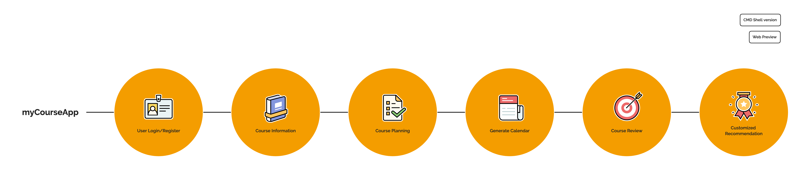
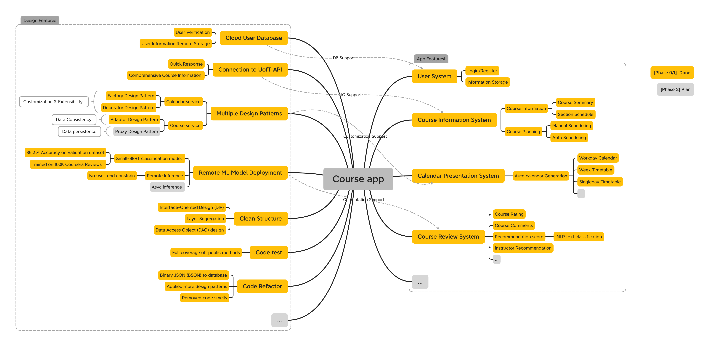
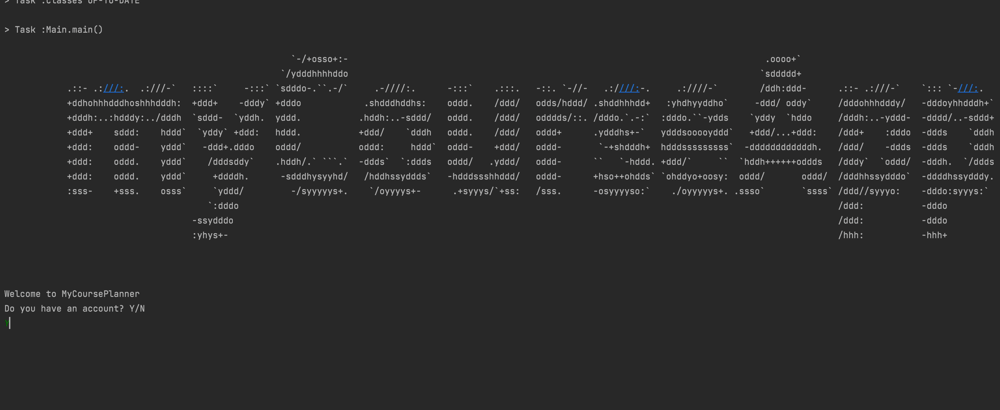
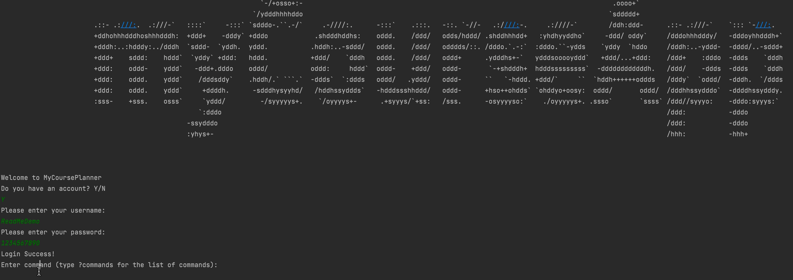
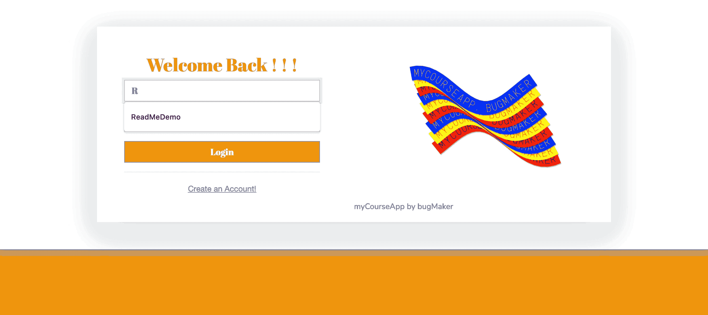

## myCourseApp - Course Planning Platform for UofT Students


> Web service, inference server and cloud mongoDB for this project have been terminated, woohoooo!


> Note that this project requires `JDK1.8` and internet connection for could database operation and machine learning model inference. Dependencies can be found in  `build.gradle` . Please refer to `teamDocumentation` and `phase1` for details.

> Our primary code base is on branch `main`, please refer to `main` for code quality evaluation.

***

[](http://bugmaker-env.eba-ss4i3etw.us-east-2.elasticbeanstalk.com/)
[](https://kuan-pang.github.io/course-project-bug-makers/)


## What is myCourseApp?


For our CSC207 project, we are planning to build a course planning app that allows students to plan and review their courses. A build-in connection to UofT API will present comprehensive course information to users, while user information is safely stored in a remote database. Course planning functionality is provided through our auto-scheduling algorithm. Timetable visualization functionality gives user a convenient course scheduling experience. Students can rate and write reviews on courses they have taken before. Based on these reviews and the user's information, our machine learning model strives to recommend instructor tailored to the user’s request and program requirements. In addition, our app aims to provide a platform for students to connect and network with their fellow peers.


## Progress Summary & Design Highlights


## Play around

- Run `course-project-bug-makers.jar` for our CLI app (click [here](teamDocumentation/cmdDocumentation.md) for interesting commands).
- Visit http://bugmaker-env.eba-ss4i3etw.us-east-2.elasticbeanstalk.com/ for our web deployment.


## System Requirements

- *JDK1.8*
- Dependencies
  - `mongodb-driver:3.12.10` : Cloud Database Access
  - `gson:2.8.8` : JSON Support
  - `junit-jupiter-api:5.8.1'`: JUNIT Test
  - `httpcore:4.4.14'` & `httpclient:4.5.13`: Apache HTTP Request Support


## Sample Usage for our CLI

We have a test account for you!
1. Run `Main.java` (in `main` branch ). Or, run `course-project-bug-makers.jar`. Try to log in our test account!
   - Username: `ReadMeDemo`;
   - Password: `1234567890`.
2. Explore `CSC207F`'s summary!
```
$ getCourseGeneralInformation CSC207F
```
3. Check our excellent pre-set course list (and then *Star* our Project)!
```
$ getCourseList
``` 
4. Try our auto-generated calendar and take a screenshot (share it to your Ins story)! 
```
$ presentCalendar F Workday
```
5. Try our course review system!

```
$ getInstReviewSummary CSC207
```
```
$ getInstRank RTC
```

6. Click [here](teamDocumentation/cmdDocumentation.md) for more interesting commands (make sure you have `JDK 1.8`)!

Here's our little GIF instruction:




## Sample Usage for our web interface


> Click [here](http://bugmaker-env.eba-ss4i3etw.us-east-2.elasticbeanstalk.com/) to access the website.


We also have a test account for you in our web interface! 

We have a test account for you!
1. Click above link (source code is in `dev/springboot`). Try to log in our test account!
    - Username: `ReadMeDemo`;
    - Password: `1234567890`.
2. Explore `CSC207F`'s summary!

3. Check our excellent pre-set course list (and then *Star* our Project)!

4. Try our auto-generated calendar and take a screenshot!


