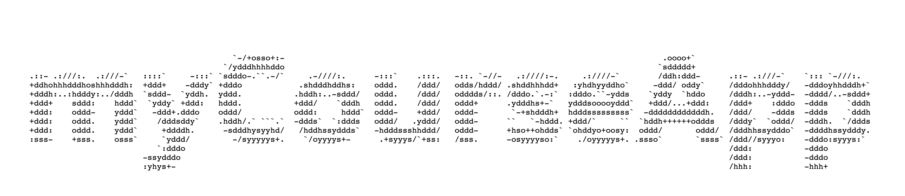
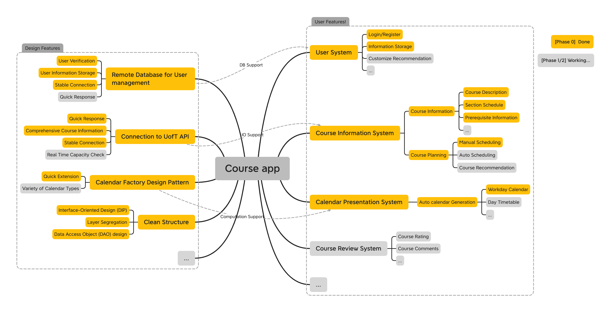

## myCourseApp - Course Planning App for UofT Students

> Note that this project requires `JDK16` . Dependences can be found in  `build.gradle ` . Please refer to `teamDocumentation` for details.

## What is myCourseApp?

For our CSC207 project, we are planning to build a course planning app that allows students to plan and review their courses. A build-in connection to UofT API will present comprehensive course information to users, while user information is safely stored in a remote database. Along with an auto-scheduling algorithm that can help with course planning, a timetable visualization function gives a convenient course scheduling experience. Based on student reviews and user information, our app can also recommend specific courses tailored to the user’s program requirements. Alongside the course planning function, our app aims to provide a platform for students to connect and network with their fellow peers. 

## Progress Summary & Design Feature Highlights

## System Requirements

- *JDK16*
- Dependency
  - `mongodb-driver:3.12.10` : User Database Access
  - `gson:2.8.8` : JSON Support

## Sample Usage

[Under Construction]

