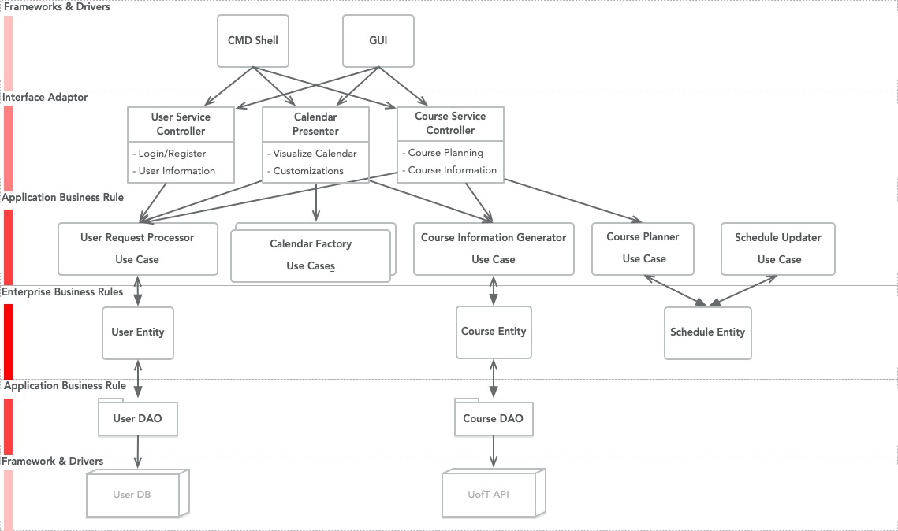
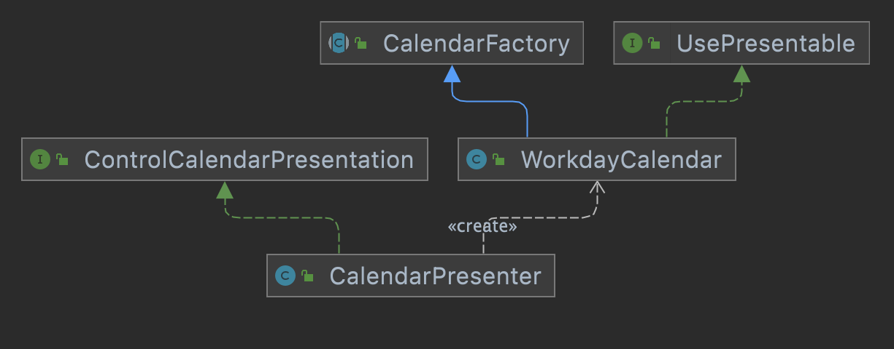
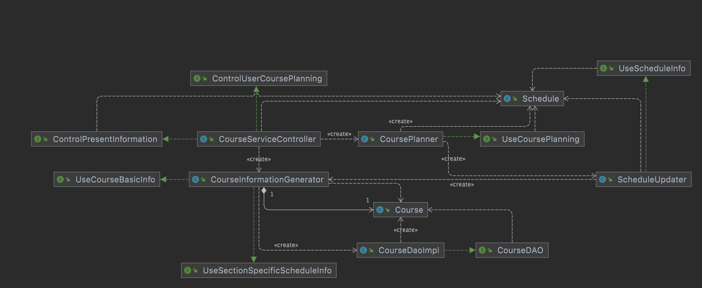
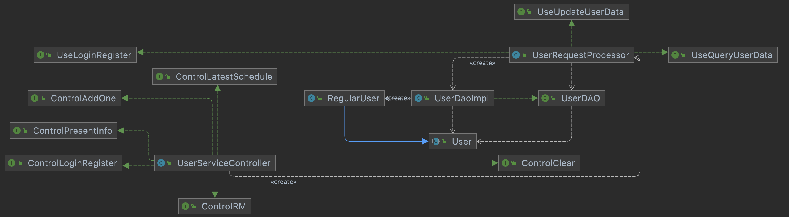
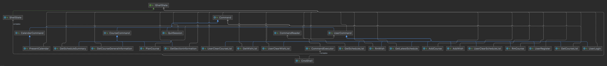

# CRC Cards Walk Through

In this document, we will walk through the CRC cards.

> Note that the CRC cards are organized into 3 main businesses of our application. The directory pathway may not reflect our file structure.

## Table of Content
1. [General Discussion](#General-Discussion)
2. [Calendar Service](#Calendar-Service)
3. [Course Service](#Course-Service)
4. [User Service](#User-Service)
5. [Driver](#Driver)

## General Discussion
- We established a clean structure with 3 controllers, 7 use cases and 3 entities with 1 CMD line driver for `Phase 0`.
- Here is our overall architecture for reference:

## Calendar Service
- We applied a *Factor Design Pattern* in this branch.
  - `CalendarPresenter`, as a controller, implements `ControlCalendarPresention` interface to provide functionality of presenting calendar. It creates a `WorkdayCalendar` use case, a subclass of `CalendarFoctory` to present the customized calendar. Note that all the `CalendarFactory` subclass will implement `UsePresentable` to provide readable String visualization.  

## Course Service
- `CourseServiceController` gives course information by using `CourseInformationGenerator`, and it helps to schedule our course timetable by using `CoursePlanner`. 
- `CourseInformationGenerator` uses `CourseDaoImpl` to create `Course` Entity to achieve course-query function. 
- `ScheduleUpdater` updates the `Schedule` Entity by retrieving information from `CrouseInformationGeneratior`. 

## User Service
- `UserServiceController` provides user information retrieval feature, data modification and user verification function by using `UserRequestProcessor`. `UserRequestProcessor` uses  `UserDaoImpl` to create `User` Entity to retrieve user information. 

## Driver
- `Commands` consistes of three main subclasses ---- `CalendarCommand`, `CourseComnmand` and `UserCommand`. Each collects a series of commands. Commands are sent to `CmdShell` to execute under the help of `CommandExecutor` and `CommandReader`.   
