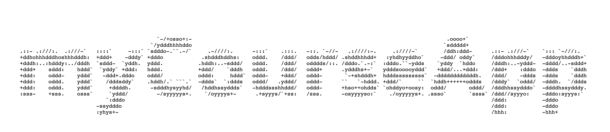

# Progress Report

## Goal for `Phase0` 

- [x] User Service: 
  - [x] Instantiate a remote MongoDB for user information storage
  - [x] Connect the database
  - [x] Perform user register and login
  - [x] Password encryption
  - [x] Store user information
  - [x] Course List modification
- [x] Course Service: 
  - [x] Querying and presenting course information from UofT
    - [x] Course sections, section schedules
    - [x] Course description, course perquisite
    - [x] Comprehensive course summary
  - [x] Course planning
    - [x] Manually plan course
- [x] Calendar Service: 
  - [x] Present a work-day Calendar
- [x] CMD Driver:
  - [x] Implement it
  

## Table of Contents
1. [Specification Summary](#Specification-Summary)
2. [CRC Model](#CRC-Model)
3. [Scenario Walk Through](#Scenario-Walk-Through)
4. [Skeleton Program](#Skeleton-Program-&-Successful-Designs)
6. [Open Questions](#Open-Questions)
7. [Summary & Next Steps](#Summary-&-Next-Steps)

## Specification Summary
For our CSC207 project, we are planning to build a course planning app that allows students to plan and review their courses. A build-in connection to UofT API will present comprehensive course information to users, while user information is safely stored in a remote database. Along with an auto-scheduling algorithm that can help with course planning, a timetable visualization function gives a convenient course scheduling experience. Based on student reviews and user information, our app can also recommend specific courses tailored to the user’s program requirements. Alongside the course planning function, our app aims to provide a platform for students to connect and network with their fellow peers.

Click [here](progress_report.md) for details.

## CRC Model
- We established a clean structure with 3 controllers, 7 use cases and 3 entities with 1 CMD line driver for `Phase 0`.
  - 3 Controllers refer to our three main businesses, which are User Service, Calendar Service and Course Service.
    - User Service (`UserServiceController`): Responsible for user requests processing, e.g. register, login, retrieve user information.
    - Calendar Service (`CalendarPresenter`): Generate a timetable reflecting our current course schedule.
    - Course Service (`CourseServiceController`): Give course information. Help to schedule our course timetable.
  - 7 Use Cases are implemented to assist controllers.
    - User Service: `UserRequest`, with `UserDAO`, helps to interact Database to query/modify user data.
    - Calendar Service: `Calendar Factory` adopts the *Factory Design Pattern* to produce readable timetable representation.
    - Course Service: `CourseInformationGenerater`, with `CourseDAO`, helps to interact with UofT Art&Sci API to query the course information. `CoursePlanner` and `ScheduleUpdater` work together to provide auto-scheduling service based on course list.
  - 3 entities are implemented to organize information.
    - `User` will help to organize the user information, including course list and wish list. `Course` will help to organize the course information. `Schedule` will help to organize the schedule information. 
- We applied interface-oriented principle, where we segregate the dependencies by interfaces.
- Here is our software architecture diagram (for implemented part), showing the layer segregation:

- Here is our class dependency overview (for implemented part).

Click [here](crcCards/crcWalkThrough.md) for details.

## Scenario Walk Through

- User will register/login an account, and then query course information. User can add their desired courses to course/wish list. After our algorithm generating a course schedule for the user, user can get a variety of timetables to help with user's time management. Note that, in the future, user will be able to access a forum to write reviews/rate courses.

Click [here](walkthrough.md) for details.

## Skeleton Program & Successful Designs
- We have `7.7k` lines implemented/optimized in our `Phase 0` project in total.
- [Kuan Pang & Michael Fang] We have successfully constructed a remote MongoDB to manage our user information, alongwith

## Open Questions

## Summary & Next Steps

