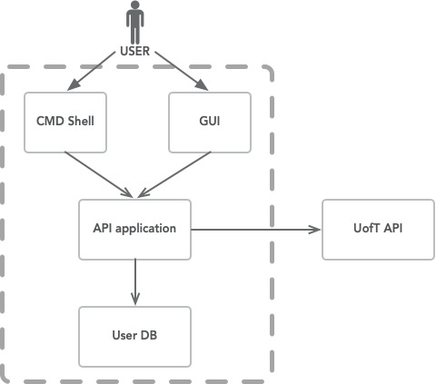
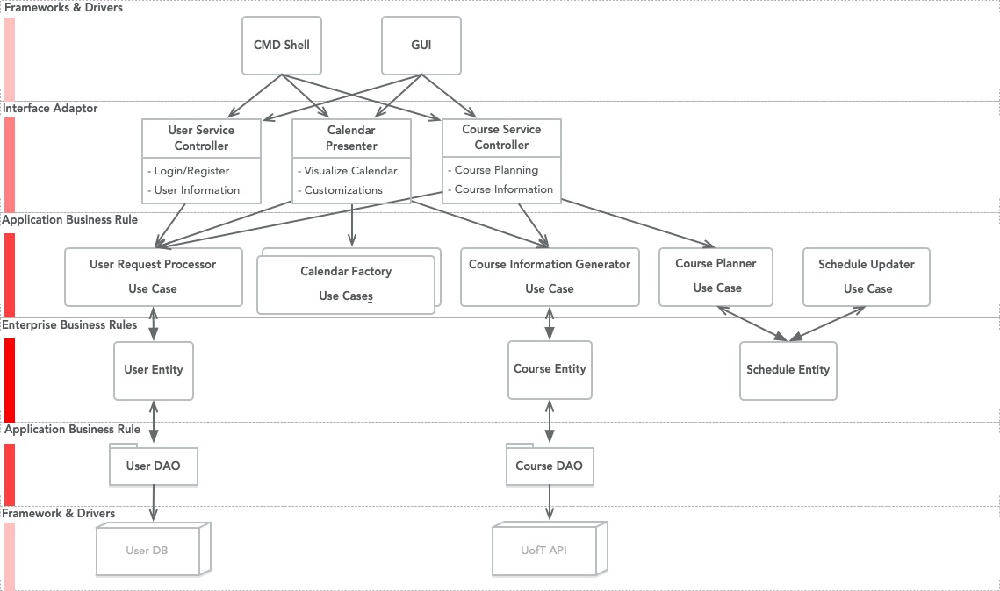

# Specification

## Table of Content

1. [Introduction](#Introduction)
2. [Feature Discussions](#Feature Discussions)
3. [Project Architecture](#Project Architecture)
4. [Phase0 Plan](#Our Phase 0 Plan)

## Introduction

For our CSC207 project, we are planning to build a course planning app that allows students to plan and review their courses. A build-in connection to UofT API will present comprehensive course information to users, while user information is safely stored in a remote database. Along with an auto-scheduling algorithm that can help with course planning, a timetable visualization function gives a convenient course scheduling experience. Based on student reviews and user information, our app can also recommend specific courses tailored to the user’s program requirements. Alongside the course planning function, our app aims to provide a platform for students to connect and network with their fellow peers. 

## Feature Discussions

### 1. User Register/Login & Data Storage

When a user registers for an account, they will be required to create a username and password so that they can save 
any changes to their account then log back in when needed. The user account will store information such as the user’s 
ID, course planning list course wish list, as well as their schedule history.

Note that the course planning list and course wish list are different when it comes to course planning, course planning list your mediatory course list but wish list is your "electives". They have a priority difference in course planning.

### 2. Course Information

The main function of our app is to allow students to add specific courses to their timetable. Each course has a name 
and a course code, as well as other details about the course such as its breadth category, distribution category, 

### 3. Scheduling & Calendar Presentation

When a user wants to plan a new schedule, our app will generate a calendar that will allow students to visualize their 
current timetable. Each schedule has a course, a section, and a time slot. When a student wants to plan a schedule into
their timetable, the schedule will be added to the user’s current timetable, which is a list of their current schedules.
Students can search up information such as a course’s description, as well as their current timetable.

### 4. Scheduling 
When a user wants to plan a new schedule, our app will generate a calendar that will allow students to visualize their 
current timetable. Each schedule has a course, a section, and a time slot. When a student wants to plan a schedule into
their timetable, the schedule will be added to the user’s current timetable, which is a list of their current schedules.
Students can search up information such as a course’s description, as well as their current timetable and courses they 
have previously taken. 

### 5. Submitting Reviews

Alongside planning their timetable, students can submit reviews of their courses on the reviews forum. Each review 
should contain a rating out of 5 and an optional comment made by the user about the course. Once a review is submitted, 
it will be posted onto the reviews forum, where other students can publicly view. Based on the rating of the courses, 
our app will use an algorithm to recommend specific courses to a user. The algorithm will also take into account the 
user’s program, year as well as time availability for the respected course. 

## Project Architecture

- There are two user-oriented interfaces: GUI and CMD line interface. As we are going to store our user data remotely, our application involves the connection to MangoDB. Data from UofT Art&Sci API should be analyzed for querying course information. Here is our container diagram:

- Clean structure with layer segregation should be performed:

- Frameworks & Drivers: User Data Base, UofT API, CMD Shell and GUI;
- Controllers: User Service Controller, Calendar Presenter and Course Service Controller;
- Use Cases: User Request Processor, Calendar Factory, Course Information Generator, Course Planner, Schedule Updater; Note that there are two special use cases: User DAO and Course DAO, they interact with DB/API to create user entity and course entity respectively.
- Entities: User, Course, Schedule.

## Our Phase 0 Plan

- We are dividing our `Phase 0` application into three main branches:
  - User Service:
    - Instantiate a remote MongoDB for user information storage and establish built-in connection to the db.
    - Perform user register and login.
    - Storage and modification of user information, including a course planning list, wish list and schedule list.
  - Course Service:
    - Querying and presenting course information from UofT
      - Course sections, section schedules
      - Course description, course prerequisite
      - Comprehensive course summary
    - Course planning
      - Manual course planning
  - Calendar service
    - Realize a work-day calendar based on user's course list

