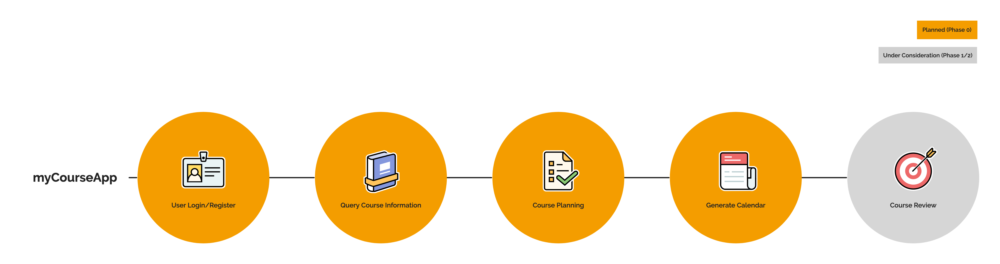
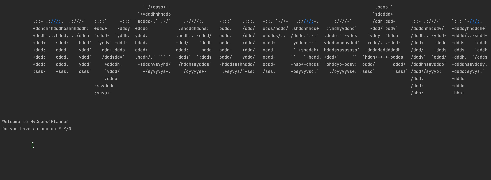
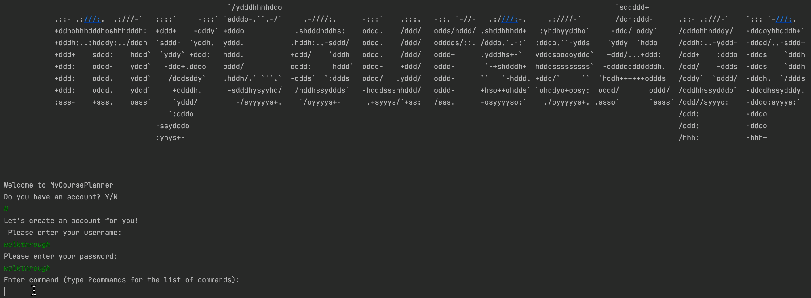
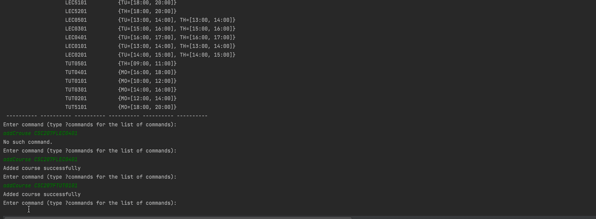
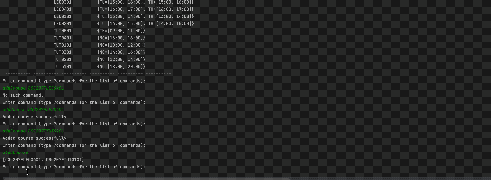

# Scenario Walk-through

Consider a scenario when an existing user wants to add a single course to a new timetable:

 ### Login
From the GUI, the user will first log in to their account using their username and password. This prompts the `UserServiceController` to take this information to the `UserRequestProcessor`, which will locate the user’s account by
using the `UserDAO` to access all the user accounts stored in the MongoDB `bugMakerProject.userSheet`.

 ### Query Course Summary 
Once logged in, the user can search for the course they want to add to their timetable by the course code, for example,
“CSC207F”. The `CourseServiceController` will process the course code, then call on the `CourseInformationGenerator`,
which will get the course description by using the `CourseDAO` to access the `UofT API`.

 ### Course Planning
To add a specific section to a user’s course list, the `CourseServiceController` will process the section course code,
then call on the `CoursePlanner` to create a new schedule. Once the `CoursePlanner` creates a schedule with the help from `ScheduleUpdater`. Then the `CourseServiceController` will call on the `UserRequestProcessor` to locate the user’s account and store the new `Schedule`
in the user’s schedule list, subsequently, `UserDAO` will sync with the user database for this update.

 ### Present Calendar
When a user wants to create a timetable, the `CalendarPresenter` will process this action by using the
`CalendarFactory` to generate a calendar. To do this, the `CalendarPresenter` will take in user's latest `Schedule` map with specific time slot(s) for each section. It will pass the user `Schedule` map into the
`CalendarFactory`, which will create a timetable for the user. Note that `CalendarFactory` offers a variety of calendar types and customizations. 

### Submitting Reviews [Reserved for Phase1/2]

Alongside planning their timetable, students can submit reviews of their courses on the reviews forum. Each review
should contain a rating out of 5 and an optional comment made by the user about the course. Once a review is submitted,
it will be posted onto the review forum, where other students can publicly view. Based on the rating of the courses,
our app will use an algorithm to recommend specific courses to a user. The algorithm will also take into account the
user’s program, year as well as time availability for the respected course. 

