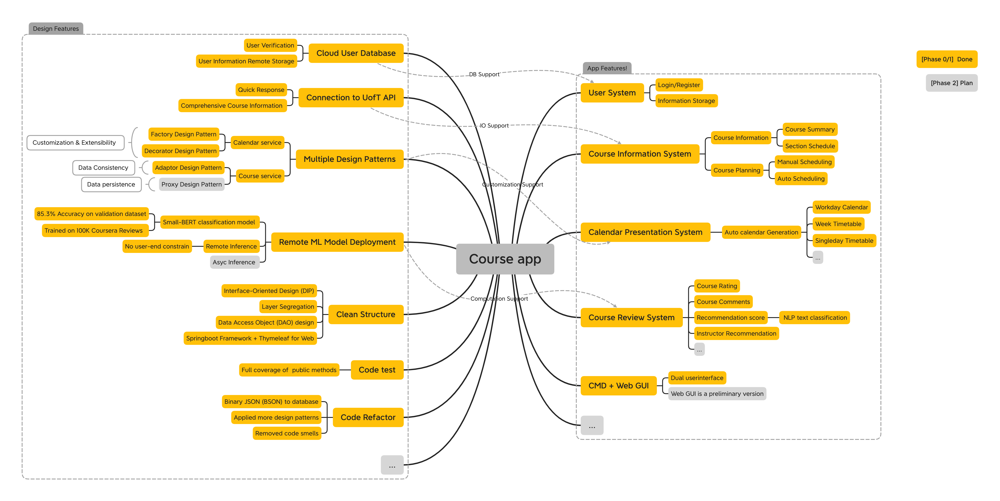
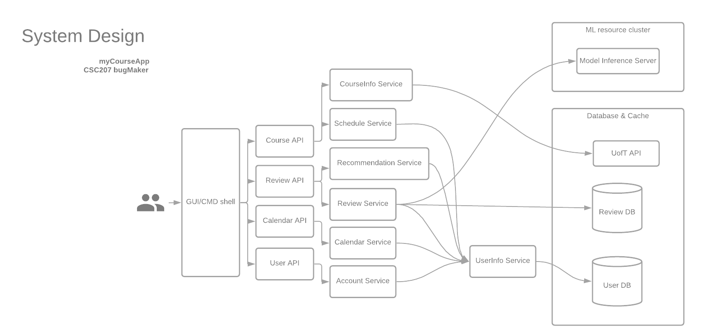
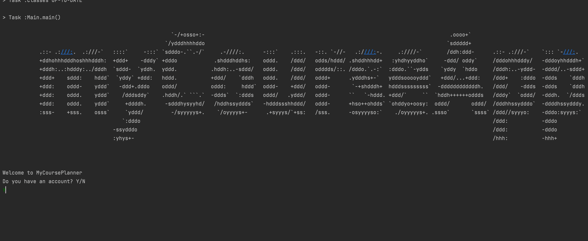
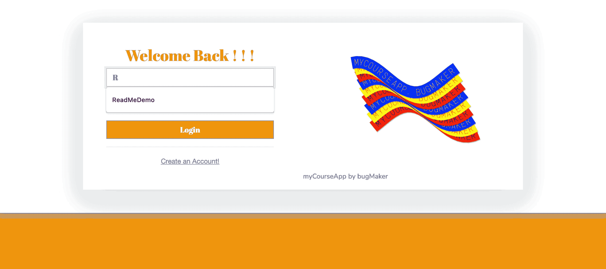
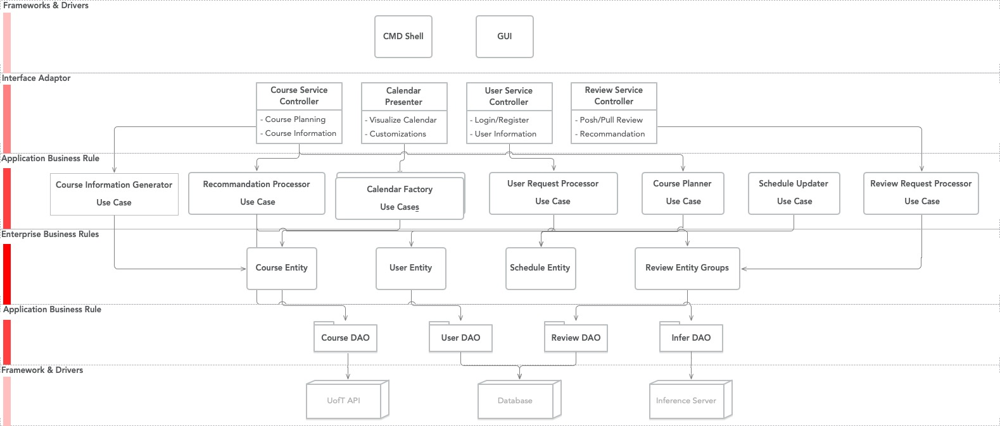
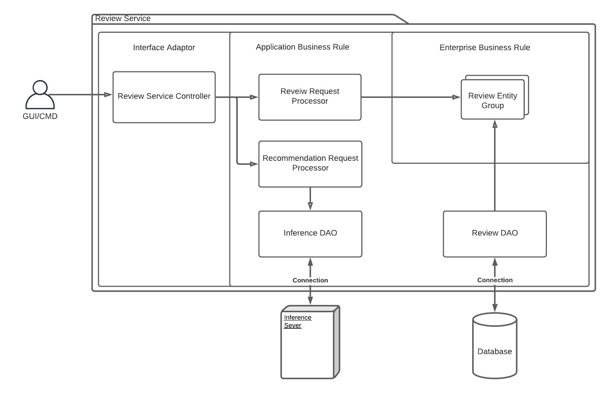
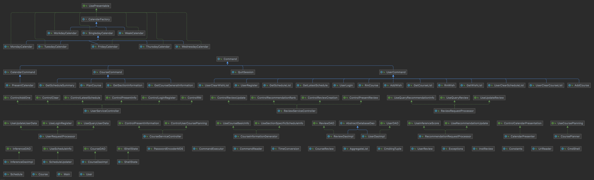
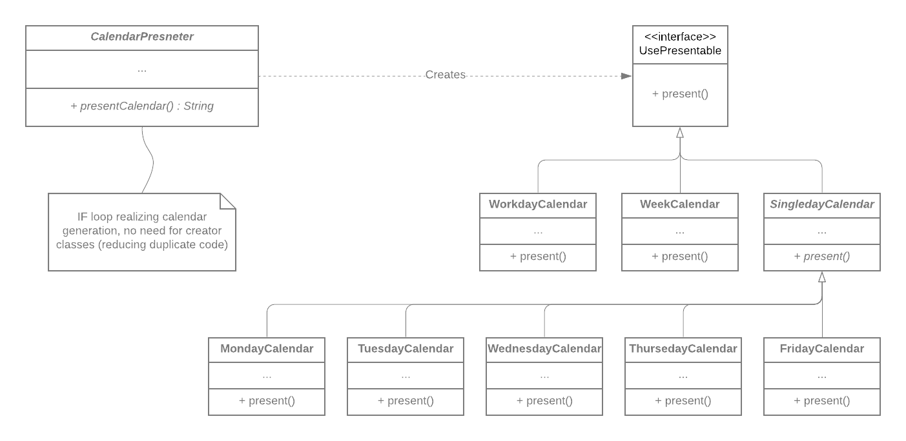
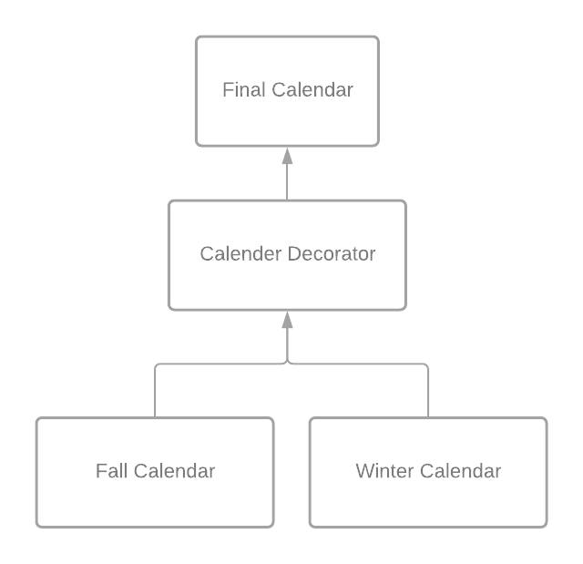
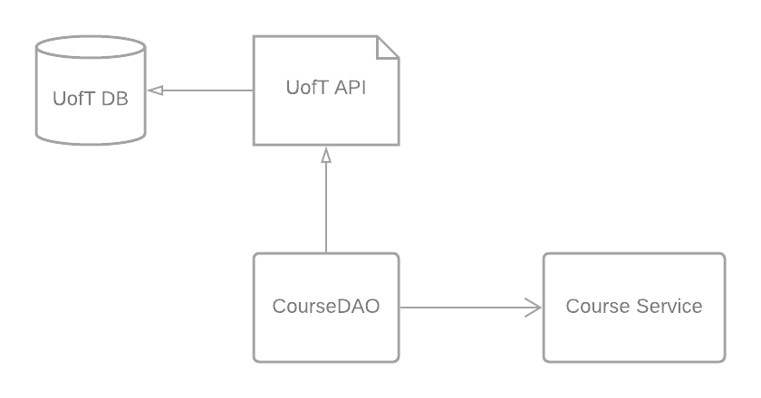

# myCourseApp Design Document

## Table of Contents
1. [Specification Summary](#Specification-Summary)
2. [Major Design Decisions & Functionalities](#Major-Design-Decisions-and-Functionalities)
3. [Clean Architecture ](#Clean-Architecture)
4. [SOLID Design Principals](#SOLID-Design-Principals)
5. [Summary of Design Patterns](#Summary-of-Design-Patterns)
6. [Packaging Strategies and Documentations](#Packaging-Strategies-and-Documentations)
7. [Code Refactoring](#Code-Refactoring)
8. [Use of GitHub Features](#Use-of-GitHub-Features)
9. [Code Testing](#Code-Testing)
10. [Open Questions and Phase 2 Goals](#Open-Questions-and-Phase-2-Goals)

### Specification Summary
For our CSC207 project, we are planning to build a course planning app that allows students to plan and review their courses. A build-in connection to UofT API will present comprehensive course information to users, while user information is safely stored in a remote database. Course planning functionality is provided through our auto-scheduling algorithm. Timetable visualization functionality gives user a convenient course scheduling experience. Students can rate and write reviews on courses they have taken before. Based on these reviews and the user's information, our machine learning model strives to recommend instructor tailored to the user’s request and program requirements. In addition, our app aims to provide a platform for students to connect and network with their fellow peers.

***
### Major Design Decisions and Functionalities

We'll be referring to the following system design diagram in our discussion.

- Course Service: present course information to users and seclude the timetable based on user's course list, by a tested scheduling algorithm. ([here](/teamDocumentation/CourseServiceControllerDocumentation.md) for details)
- Review Service: user can rate and share their comments to instructors and courses. In addition, review service integrates with our course service to provide instructor recommendation functionality thorough a machine learning approach. ([here](/teamDocumentation/ReviewServiceDocumentation.md) for review detail and [here](/teamDocumentation/ReviewRecommendationSystem.md) for ML detail)
- Calendar Service: visualize user's schedule by presenting calendar and timetables. Note that we offer 7 types of calendar design and 3 term options, which produces 21 customizations for our user. ([here](/teamDocumentation/CalendarServiceDocumentation.md) for details)
- User Service: storing and synthesising user's information stored in our cloud database. ([here](/teamDocumentation/UserServiceDocumentation.md) for details)
- CMD shell/ Web GUI: parallel systems providing multiple ways for user to interact with our system.
  - CMD shell's demo (stable release, [here](/teamDocumentation/cmdDocumentation.md) for commands):
    - 
    - 
  - Web interface demo (preview in our `dev/springboot`):
    - 

Storing and Loading States

- As can be seen from the diagram, all of our services interact with our database. More specifically,
we have many services that interact with the user database through the UserInfo Service. This is the
main method by which our app stores and loads states.

- When a user logs in through the Account Service, they load their account data from all previous sessions. That means
any timetables they have created and saved in the past can be loaded directly from the database, and their course and
wishlists persist across load states. Our app can then generate the same calendar each time using the information from the database.

- By the same token, a user can store new data or alter their old account data using the various services, to be loaded up from the
user database the next time they log in.

- Our app also stores reviews created by users. When a user creates a review for a particular course, it is stored in the database.
Then, other users loading reviews for the course will load the new review as well!

  
***
### Clean Architecture 

- Overall structure
  - Our app consists of 4 controllers, 11 use cases and 4 entity groups, where the overall structure can be demonstrated in the following architecture diagram.
    
  - Our architecture design strictly follows the clean architecture principle, where code dependencies are unidirectional, going from outer layer to the inner layer.
  - Our controller layer (or Interface Adaptor layer) are designed to be the only layer exposing to front-end, it interacts with our use case layer (or Application Business Layer) to execute user's request.
  - Our use case layer then interacts with our entity layer (or Enterprise Business Rules). As we have connection with database, there is one extra DAO layer (classified as Application Business Rule) to perform the data I/O requests.
- Example: Review Service Branch, a layer segregation design
  - As shown in following graph, we demonstrate a clean architecture in our Review Service Branch. Begin with our user sending a review creation request to `Reveiw Service Controller`. Our `Review Service Controller` calls `Recommendation Request Request Processor` (use case) to generate a recommendation score of user review. The generation of machine learning recommendation score is running on our remote inference server, where the connection to inference server is established by `Inference DAO` (use case) without violating clean architecture principle.
  - Once obtained a response from inference server, our controller calls `Recommendation Request Processor` (use case), to config a review entity and then update to the database through `Review DAO`.
  - Therefore, our dependency is constructing from outer layer to inner layer without bypassing intermediates. Thus, strictly following clean architecture principle.
  - 

***
### SOLID Design Principals
As a refresher, the SOLID Design Principals stand for:

> `S`ingle responsibility principal (SRP)
> 
> `O`pen/closed principal (OCP)
> 
> `L`iskov substitution principal (LCP)
> 
> `I`nterface segregation principal (ISP)
> 
> `D`ependency inversion principal (DIP)

###### 1. Single Responsibility Principal (SRP)
The SRP states that: 
> Every class should have a **single responsibility**, therefore
> each class should only have **one reason to change**.

The SRP is demonstrated through the CRC cards we created in Phase 0. Through these cards,
you can see that every object has a single responsibility. For example, if we look at 
the `User.txt` CRC card found in `phase0/crcCards/userServiceBranch/User.txt`, you will find 
that it's single responsibility is to store user information and role. Therefore, if we wanted to store 
a new piece of information about the user, we would only have to make changes to the User object as it is
the only object responsible for storing this information.

###### 2. Open Closed Principal (OCP)
The OCP states that: 
> Software entities such as classes, modules, and functions should be **open 
> for extension but closed for modification.**

The OCP is demonstrated through the use of inheritance throughout our code. For instance, 
we can first look at `SingledayCalendar`, an abstract subclass of `CalendarFactory` which is responsible for 
generating a one-day calendar. `SingledayCalendar` has 5 subclasses: `MondayCalendar`, `TuesdayCalendar`,
`WednesdayCalendar`, `ThursdayCalendar`, and `FridayCalendar`. `CalendarFactory` further implements the `UsePresentable` interface, 
which has a method called `present`. This method will be inherited by each specific-day calendar since it extends 
`SingledayCalendar` which extends `CalendarFactory`.

Instead of directly modifying the `present` method, we had all the different calendars extend to `CalendarFactory` which implements
the `UsePresentable` interface. Through this, we were able to keep the objects open 
for extension but closed for modification, thus abiding to the OCP.

###### 3. Liskov Substitution Principal (LCP)
The LCP states that:
> If an object of type S is a subtype of T, then you may
> substitute objects of type S with objects of type T without altering any of the desired properties
> of the program.

The LCP is demonstrated through the use of many interfaces in our program. For instance, lets look at our 
`MondayCalendar` class again. `MondayCalendar` is a subclass of `SingledayCalendar`, and from one perspective
we could say that `MondayCalendar` "is a" `SingledayCalendar`. However, this is not completely true, because 
a `SingledayCalendar` has more behaviours than a `MondayCalendar`. Therefore, in this case, `MondayCalendar` extends 
`SingledayCalendar` and implements the `UsePresentable` interface so that it does not modify or remove features of 
its superclass.

###### 4. Interface Segregation Principal (ISP)
The ISP states that: 
> No client should be forced to implement irrelevant methods of an interface. Instead of 
> having a few large interfaces, it is better to have a lot of small, specific
> interfaces.

The ISP is demonstrated through the multiple interfaces we have created for our classes. For instance, our 
`ReviewRequestProcessor` class in `ReviewService` implements three different interfaces: `UseQueryReview`, 
`UseUpdateReview`, and `UseQueryRecommendationInfo`. Instead of implementing one big interface, we seperated 
the methods into three interfaces so that we will not have to implement any irrelevant methods when using an interface.

###### 5. Dependency Inversion Principal (DIP)
The DIP states that:
> - High-level modules should not be dependent on low-level modules. Both should be dependent on abstractions.
> - Abstractions should not be dependent upon details, rather, details should be dependent on abstractions.

The DIP can be demonstrated through our class diagram:
###### Figure 3: Class Diagram

You can see that none of the classes hold a reference to a concrete class, they only hold references
to either an abstract class or an interface. For instance, we can take a look at our `MondayCalendar` again. Instead of 
directly depending on the `CalendarFactory` to generate a calendar, both classes implement the interface `UsePresentable`,
which allows both of the classes to use a method called `present`. This makes sure that both classes are dependent on 
abstractions instead of being dependent on one another from high-level to low-level.

***
### Summary of Design Patterns
- We incorporated various design patterns in our project, including Factory Method, Decorator and Adapter etc. We will be focusing on several highlights in this design document.
- **Factory Method Design Pattern**: Click [here](https://github.com/CSC207-UofT/course-project-bug-makers/pull/42) for associated PR and [here](https://github.com/CSC207-UofT/course-project-bug-makers/issues/41) for associated issue.
  - Background
    - In our calendar service, we are providing user with various customization choices, such as Workday Calendar, Week Calendar, and Single-day Calendar etc. Thus, we are looking for design pattern with extensibility and rapid deployment.
  - Implementation
    - We implemented three styles of calendars and seven types of calendars in total for our Phase 1, they implement `UsePresentable` interface to generate readable string representation.
    - As shown in following diagram, we established a Factory Method pattern in our `CalednarService` branch, where our calendars with `UsePresentable` interface serve as products in Factory Method design pattern. The `Calendar Presenter` creates Calendars and call its implemented `UsePresentable` interface to realize calendar visualization.
    - 
  - Advantage
    - By applying Factory Method design pattern, we will organize "calendar" visualization and differentiations.
    - Factory Method design pattern provides an architecture that is open to extension, which means we can design more calendar types for our users without substantial codebase changes.
- **Decorator Design Pattern**: Click [here](https://github.com/CSC207-UofT/course-project-bug-makers/pull/42) for associated PR and [here](https://github.com/CSC207-UofT/course-project-bug-makers/issues/41) for associated issue.
  - Background
    - Similar to the previous one, we would like to provide more customizations to our calendar, where we allow the user to choose the calendar term. For example, the calendar will present the fall/winter term only or the whole year (combination of fall/winter term).
    - We would like to reduce the duplicate code and simply the codebase maintenance.
  - Structure
    - As shown in the following diagram, we established a Decorator Design Pattern, the fall calendar and winter calendar are pushed to the calendar decorator for processing, either combining them to produce a year calendar or keeping them original.
    - The calendar decorator is encoded in `typeDecorator()` method in `CalendarPresenter` class.
    - 
  - Advantage
    - It enables multiple presentations of our calendar.
    - By applying Decorator design pattern, we reduced our duplicated code.
- **Adaptor Design Pattern** Click [here](https://github.com/CSC207-UofT/course-project-bug-makers/pull/37) for the refactor PR.
  - Background
    - In our course service branch, we need to query data from the UofT database through UofT's API. However, the course information provided by UofT API is too complicated and lack interpretability. In addition, it comes in an HTTP body and JSON format, which could not be converted into Java object directly.
    - Therefore, we need an Adaptor to connect with the UofT API to convert the data into desired data type by extracting desired information from the JSON file.
  - Structure
    - As shown in the following diagram, our `CourseDAO` queries data through UofT API, then it extracts and processes data to push to our Course Service branch.
    - 

  - Advantage
    - This design pattern helps to ensure the "Single Responsibility Principle", where the UofT API connection is segregated from our main business.
    - We are able to refactor this adaptor to rapidly deploy our app in another university, it is open to extension.
    - It also simplifies the data flow within our app, as it only extracts useful information and  reformats the data structure to fit our needs.
    
***
### Packaging Strategies and Documentations
- For our code organization, we applied a service-oriented packaging strategy. As we have four service branches (course, calendar, review and user), we organized them into four packages. As `DAO` and `Entiteis` are often shared across the scope, we decided to organize them in their own packages. As for drivers, we split out a new package for the sake of layer segregation and clarity. Besides, we stored our utilities, including password encryption tool, in the util package. We benefit from this organization as it demonstrates clear service differentiation and improves our file structure.
- As of our code documentation, we have a J-DOC website for sharing documentation, click [here](https://kuan-pang.github.io/course-project-bug-makers/) to navigate. Our design goals and specifications are listed in our `teamDocumentation` directory. Our code documentation improves our teamwork and keeps a organized record of our achievement.

***
### Code Refactoring

- We have refactored our codebase and resolved several code smells using Design Patterns:
  - We applied Decorator Pattern to resolve the code smell "Duplicated Code".
    - While incorporating new Calendar types, we realized that the original controller `CalendarPresenter` had a substantial amount of code duplications. 
    - In PR[#42](https://github.com/CSC207-UofT/course-project-bug-makers/pull/42), we refined it with Decorator Design Pattern, and, thus, resolved the duplication. Calendars are now pushed to the calendar decorator for further processing.
- Meantime, we also extracted methods into superclasses and resolved code smells by inheritance. 
  - For instance, in our Calendar Service PR[#52](https://github.com/CSC207-UofT/course-project-bug-makers/pull/52), we realized there were several common methods, such as `markCell` (add course code onto the calendar). We extracted them into a superclass and turned them into `Protected` methods. By inheritance, subclasses could call the methods without duplication. In this way, we significantly reduced code base size while strictly following SOLID principle.
- In addition, we also refactored our code for improving user experience and code readability. 
  - We customized a codec for our `DAO` and achieved a better database performance through applying POJO (plain old java object) support, where we directly stored the entities in the database through binary JSON. Aside from DB performance enhancement, this feature increases the readability of our codes. Details are explained in PR[#](https://github.com/CSC207-UofT/course-project-bug-makers/pull/43).

***
### Use of GitHub Features
- Multiple issues were opened and resolved by pull requests to meet our `Phase1` goals, for example:
  - We established an auto-workflow, using `fix` statement to link the PR to the issue
    - Issue [#49](https://github.com/CSC207-UofT/course-project-bug-makers/issues/49):
      - Conflicts arose within our dependencies under JDK16 environment, so we decided to downgrade it to JDK1.8
      - JDK successfully downgraded by merged pull requests: PR [#50](https://github.com/CSC207-UofT/course-project-bug-makers/pull/50), PR [#51](https://github.com/CSC207-UofT/course-project-bug-makers/pull/51)
  - We also labeled issues to keep our workspace organized.
    - Issue [#45](https://github.com/CSC207-UofT/course-project-bug-makers/issues/45) is labelled as enhancement
      - `userService` needs to support `reviewService`, so we decide to enhance their skeleton.
      - `userService` successfully supports operations on `review` entity groups with integrated database by merged pull requests: PR [#47](https://github.com/CSC207-UofT/course-project-bug-makers/pull/47)
- Over 90% of merged Pull Requests were reviewed and approved by other team members. The PR brings significant improvements in our team communication regarding:
  - New functionalities, and
  - Fixed bugs or typos, and
  - Codebase refactors.
- We used GitHub Actions, complimented with auto-testing Workflow, to keep our codebase robust and reduce potential runtime errors.

***
### Code Testing
- We achieved FULL test coverage for the testable Service Controllers. **73%** of the methods in our system were covered by our test cases.
- We introduce randomness in the code-test system, to ensure test case comprehensiveness.
  - We make `userRegister()` testable by generating random Usernames.
- In the most challenging database test, for the data access objects, we developed a full set of approaches to test the codes without interfering the normal functionality of our database.
  - In the `createNewCourse()`, we introduced randomness to avoid duplication in the database.
  - In the `UserServiceControllerTest`, after each test case, we empty the Lists to prevent subsequent changes in the database.
- Difficulties while testing:
  - Some operations are irreversible
  - Some private fields and methods are not reachable.

***
### Open Questions and Phase 2 Goals
- Open questions
  - It takes time for our inference server to run the model, the waiting time affects our user experience.
- Goals
  - Improve web GUI.
  - Apply proxy design pattern to our DAOs to realize data persistence.
  - Implement async model inference.

