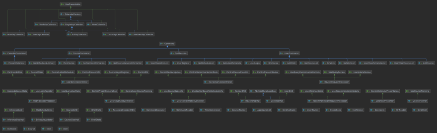

# myCourseApp Design Document

## Table of Contents
1. [Specification Summary](#Specification-Summary)
2. [Major Design Decisions](#Major-Design-Decisions)
3. [Clean Architecture ](#Clean-Architecture)
4. [SOLID Design Principals](#SOLID-Design-Principals)
6. [Packaging Strategies](#Packaging-Strategies)
7. [Summary of Design Patterns](#Summary-of-Design-Patterns)

### Specification Summary

***
###### Figure 1: Phase 1 System Design

###### Figure 2: Phase 1 Architecture Diagram

***
### Major Design Decisions

***
### Clean Architecture 

***
### SOLID Design Principals
As a refresher, the SOLID Design Principals stand for:

> `S`ingle responsibility principal (SRP)
> 
> `O`pen/closed principal (OCP)
> 
> `L`iskov substitution principal (LCP)
> 
> `I`nterface segregation principal (ISP)
> 
> `D`ependency inversion principal (DIP)

###### 1. Single Responsibility Principal (SRP)
The SRP states that: 
> Every class should have a **single responsibility**, therefore
> each class should only have **one reason to change**.

The SRP is demonstrated through the CRC cards we created in Phase 0. Through these cards,
you can see that every object has a single responsibility. For example, if we look at 
the `User.txt` CRC card found in `phase0/crcCards/userServiceBranch/User.txt`, you will find 
that it's single responsibility is to store user information and role. Therefore, if we wanted to store 
a new piece of information about the user, we would only have to make changes to the User object as it is
the only object responsible for storing this information.

###### 2. Open Closed Principal (OCP)
The OCP states that: 
> Software entities such as classes, modules, and functions should be **open 
> for extension but closed for modification.**

The OCP is demonstrated through the use of inheritance throughout our code. For instance, 
we can first look at `SingledayCalendar`, an abstract subclass of `CalendarFactory` which is responsible for 
generating a one-day calendar. `SingledayCalendar` has 5 subclasses: `MondayCalendar`, `TuesdayCalendar`,
`WednesdayCalendar`, `ThursdayCalendar`, and `FridayCalendar`. `CalendarFactory` further implements the `UsePresentable` interface, 
which has a method called `present`. This method will be inherited by each specific-day calendar since it extends 
`SingledayCalendar` which extends `CalendarFactory`.

Instead of directly modifying the `present` method, we had all the different calendars extend to `CalendarFactory` which implements
the `UsePresentable` interface. Through this, we were able to keep the objects open 
for extension but closed for modification, thus abiding to the OCP.

###### 3. Liskov Substitution Principal (LCP)
The LCP states that:
> If an object of type S is a subtype of T, then you may
> substitute objects of type S with objects of type T without altering any of the desired properties
> of the program.

The LCP is demonstrated through the use of many interfaces in our program. For instance, lets look at our 
`MondayCalendar` class again. `MondayCalendar` is a subclass of `SingledayCalendar`, and from one perspective
we could say that `MondayCalendar` "is a" `SingledayCalendar`. However, this is not completely true, because 
a `MondayCalendar` has more behaviours than a `SingledayCalendar`. Therefore, in this case, `MondayCalendar` extends 
`SingledayCalendar` and implements the `UsePresentable` interface so that if we substitute `MondayCalendar` with a 
`SingledayCalendar`, its desired properties will not be altered.

###### 4. Interface Segregation Principal (ISP)
The ISP states that: 
> No client should be forced to implement irrelevant methods of an interface. Instead of 
> having a few large interfaces, it is better to have a lot of small, specific
> interfaces.

The ISP is demonstrated through the multiple interfaces we have created for our classes. For instance, our 
`ReviewRequestProcessor` class in `ReviewService` implements three different interfaces: `UseQueryReview`, 
`UseUpdateReview`, and `UseQueryRecommendationInfo`. Instead of implementing one big interface, we seperated 
the methods into three interfaces so that we will not have to implement any irrelevant methods when using an interface.

###### 5. Dependency Inversion Principal (DIP)
The DIP states that:
> - High-level modules should not be dependent on low-level modules. Both should be dependent on abstractions.
> - Abstractions should not be dependent upon details, rather, details should be dependent on abstractions.

The DIP can be demonstrated through our class diagram:
###### Figure 3: Class Diagram

You can see that none of the classes hold a reference to a concrete class, they only hold references
to either an abstract class or an interface. For instance, we can take a look at our `MondayCalendar` again. Instead of 
directly depending on the `CalendarFactory` to generate a calendar, both classes implement the interface `UsePresentable`,
which allows both of the classes to use a method called `present`. This makes sure that both classes are dependent on 
abstractions instead of being dependent on one another from high-level to low-level.

***
### Packaging Strategies

***
### Summary of Design Patterns

