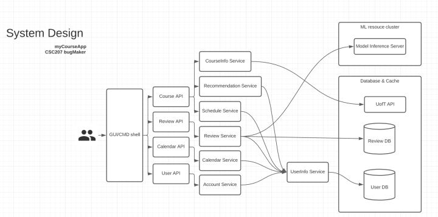

#Functionality

We'll be referring to the following system design diagram in our discussion

###Storing and Loading States

As can be seen from the diagram, all of our services interact with our database. More specifically, 
we have many services that interact with the user database through the UserInfo Service. This is the 
main method by which our app stores and loads states. 

When a user logs in through the Account Service, they load their account data from all previous sessions. That means 
any timetables they have created and saved in the past can be loaded directly from the database, and their course and 
wishlists persist across load states. Our app can then generate the same calendar each time using the information from the database. 

By the same token, a user can store new data or alter their old account data using the various services, to be loaded up from the 
user database the next time they log in. 

Our app also stores reviews created by users. When a user creates a review for a particular course, it is stored in the database. 
Then, other users loading reviews for the course will load the new review as well! 