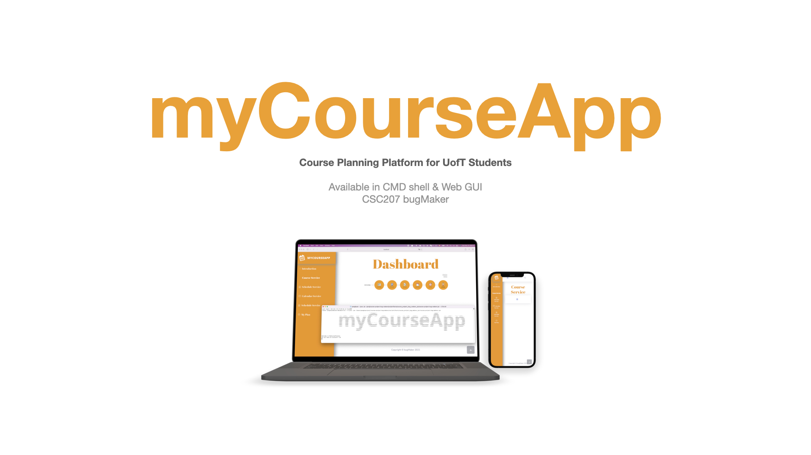
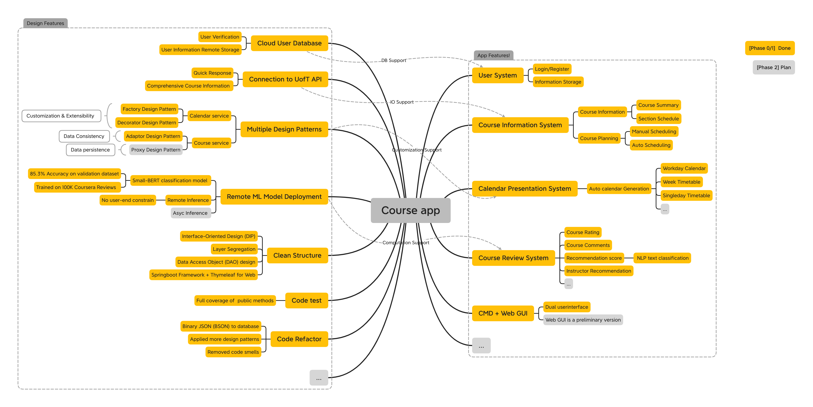

# Progress Report

## Goals for `Phase1`
- [x] TODO

## Table of Contents
1. [Successful Designs](#Successful-Designs) 
2. [Open Questions](#Open-Questions)
3. [Next Steps](#Phase-1-Progress-and-Next-Steps)

## Successful Designs
TODO:

## Open Questions
- TODO:

## Phase 1 Progress and Next Steps
- We have `k` lines implemented/optimized in our `Phase 1` project in total.
- [Kuan Pang]
- [Michael Fang]
- [Li Quan Soh]
- [Kevin Cheng]
- [Jiaming Weng]
- [Sherry You]

