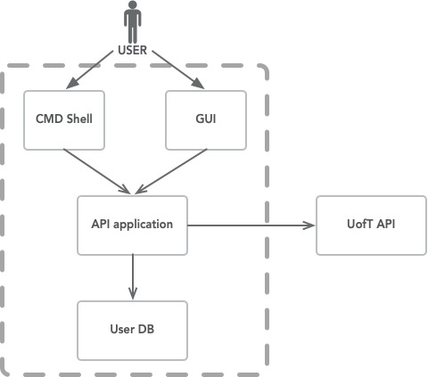

# Specification

## Table of Content

1. [Introduction](#Introduction)
2. [Phase 1 Feature Discussions](#Phase 1 Feature Discussions)
3. [Project Architecture](#Project Architecture)
4. [Phase 1 Plan](#Our Phase 1 Plan)

## Introduction

For our CSC207 project, we are planning to build a course planning app that allows students to plan and review their courses. A built-in connection to UofT API will present comprehensive course information to users, while user information is safely stored in a remote database. Along with an auto-scheduling algorithm that can help with course planning, a timetable visualization function gives a convenient course scheduling experience. Based on student reviews and user information, our app can also recommend specific courses tailored to the user’s program requirements. Finally, our app aims to provide a platform for students to connect and network with their fellow peers.

## Phase 1 Feature Discussions
Please refer to `Phase 0/Specification` for a refresher of the features implemented in Phase 0. Phase 1
feature discussions will highlight the **additional features** implemented between
Phase 0 and the end of Phase 1.

### 1. Course Review Forum 
TODO: 

### 2. Course Scheduling
TODO:

## Project Architecture

- There are two user-oriented interfaces: GUI and CMD line interface. As we are going to store our user data remotely, our application involves the connection to MangoDB. Data from UofT Art&Sci API should be analyzed for querying course information. Here is our container diagram:

- Clean structure with layer segregation should be performed:

- Frameworks & Drivers: User Data Base, UofT API, CMD Shell and GUI;
- Controllers: User Service Controller, Calendar Presenter and Course Service Controller;
- Use Cases: User Request Processor, Calendar Factory, Course Information Generator, Course Planner, Schedule Updater; Note that there are two special use cases: User DAO and Course DAO, they interact with DB/API to create user entity and course entity respectively.
- Entities: User, Course, Schedule.

## Our Phase 1 Plan

- We are dividing our `Phase 1` application into three main branches:
  - TODO:

