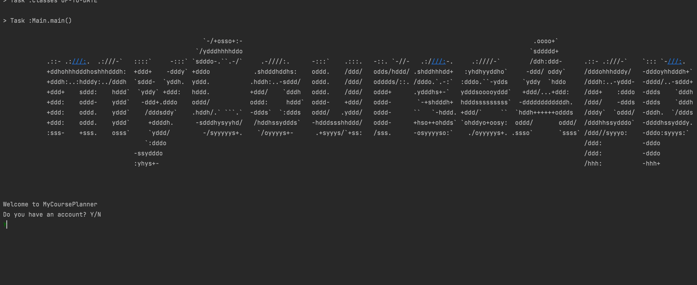

# myCourseApp Design Document

## Table of Contents
1. [Specification Summary](#Specification-Summary)
2. [Major Design Decisions & Functionalities](#Major-Design-Decisions-and-Functionalities)
3. [Accessibility Features](#Accessibility-Features)
4. [The 7 Principals of Universal Design](#The-7-Principals-of-Universal-Design)
5. [Market Analysis](#Market-Analysis)
6. [Clean Architecture](#Clean-Architecture)
7. [SOLID Design Principals](#SOLID-Design-Principals)
8. [Summary of Design Patterns](#Summary-of-Design-Patterns)
9. [Packaging Strategies and Documentations](#Packaging-Strategies-and-Documentations)
10. [Code Refactoring](#Code-Refactoring)
11. [Use of GitHub Features](#Use-of-GitHub-Features)
12. [Code Testing](#Code-Testing)
13. [Progress Summary](#Progress-Summary)
***

### Specification Summary
For our CSC207 project, we are planning to build a course planning app that allows students to plan and review their 
courses. A build-in connection to UofT API will present comprehensive course information to users, while user 
information is safely stored in a remote database. Course planning functionality is provided through our auto-scheduling 
algorithm. Timetable visualization functionality gives user a convenient course scheduling experience. Students can 
rate and write reviews on courses they have taken before. Based on these reviews and the user's information, our machine 
learning model strives to recommend instructor tailored to the user’s request and program requirements. In addition, 
our app aims to provide a platform for students to connect and network with their fellow peers.

***
### Major Design Decisions and Functionalities

We'll be referring to the following system design diagram in our discussion.

- Course Service: presents course information to users and schedules the timetable based on user's course list through a tested scheduling algorithm. ([here](/teamDocumentation/CourseServiceControllerDocumentation.md) for details)
- Review Service: user can rate and share their comments to instructors and courses. In addition, the review service integrates with our course service to provide instructor recommendation functionality thorough a machine learning approach. ([here](/teamDocumentation/ReviewServiceDocumentation.md) for review detail and [here](/teamDocumentation/ReviewRecommendationSystem.md) for ML detail)
- Calendar Service: visualizes a user's schedule by presenting calendars and timetables. Note that we offer 7 types of calendar designs and 3 term options, which produces 21 customizations for our user. ([here](/teamDocumentation/CalendarServiceDocumentation.md) for details)
- User Service: stores and synthesizes a user's information stored in our cloud database. ([here](/teamDocumentation/UserServiceDocumentation.md) for details)
- CMD shell/ Web GUI: parallel systems providing multiple ways for user to interact with our system.
  - CMD shell's demo (stable release, [here](/teamDocumentation/cmdDocumentation.md) for commands):
    - 
    - 
  - Web interface (source code in `dev/springboot`, visit http://bugmaker-env.eba-ss4i3etw.us-east-2.elasticbeanstalk.com/):
    - 

Storing and Loading States

- As seen from the diagram, all of our services interact with our database. More specifically,
we have many services that interact with the user database through the `UserInfo Service`. This is the
main method by which our app stores and loads states.

- When a user logs in through the `Account Service`, their account data from all previous sessions is loaded. This means
that any timetables they have created and saved in the past can be loaded directly from the database, and their course and
wishlists will persist across load states. Our app can then generate the same calendar each time using the information from the database.

- By the same token, a user can store new data or alter their old account data using the various services. This information
will also be loaded up from the user database the next time they log in.

- Our app also stores reviews created by users. When a user creates a review for a particular course, it is stored in the database.

Then, when other users load the reviews for a specific course, the reviews from other users will be loaded as well!

***
### Accessibility Features

In Phase 2, our group decided to implement new features to accommodate for increased accessibility:
1. **Language Translator**
   - The language translator feature allows user view and read the webpage's text in their preferred language
2. **Colour Contrast**
   - The colour contrast feature allows users to choose the colour scheme of the webpage
3. **Navigation Sidebar**
   - The navigation sidebar allows for easy access to all the pages of our website
4. **Printer-friendly calendar**
   - The printer-friendly calendar format allows user to obtain a physical copy
5. **All platform access**
   - The CLI + Web app design allows both professional users and regular users to enjoy our service 

***
### The 7 Principals of Universal Design
The following section will outline how our new features adhere to the 7 Principles of Design. 
Additional comments will be provided on additional features we could implement in the future to 
ensure full coverage of all 7 principals.

###### Principle 1: Equitable Use
MyCourseApp is intended to provide **the same means of usage for all users** while
**avoiding the segregation or stigmatizing** of any users. There are **no premium features** that are only available to certain groups of users.
**Safe storage** of user information in our Mongo Database is **provided to all users** regardless
of any factors that may differentiate the individual from others 

Notes for Future Improvement:
  - Users who identify as visually-impaired may feel unsatisfied with the visual design of our app and can 
  encounter a decrease in user experience
  - Additional features we could implement include:
    1. New colour schemes that accommodate for colour-blindness can improve the experience of 
    users with colour-blindness
    2. Font size selection, or zoom function that provides increased visibility of the text
    3. Speak feature that allow users who experience complete vision loss to listen to the text that is
    being displayed on MyCourseApp

###### Principle 2: Flexibility in Use
Currently, MyCourseApp does not have any features that can accommodate for a wide range of users with 
specific preferences and abilities. 

Notes for Future Improvement:
- To accommodate for right or left-handed access and use, we could update the navigation 
bar so that users can relocate the navigation bar to the right or left depending on their ease of accessibility and 
preferences
- Implementation of the speak feature would allow users to have the choice of reading or listening to 
the text displayed on MyCourseApp's website depending on their preferences and abilities. 
- Implementation of a voice recognition software could allow users to have the choice of either speaking or typing 
into the application, as the voice recognition software would be capable of transcribing speech into text format
- Implementation of fingerprint recognition could allow users to choose between typing their login credentials or 
using their fingerprint to login into their account 

###### Principle 3: Simple and Intuitive Use
MyCourseApp's new language selection feature allows users to read and understand the text in their preferred language. 
Through this feature, we are able to accommodate to a wider range of users with different levels of literacy and 
language skills. In addition, the new navigation bar feature allows the user to easily navigate through the pages of 
our website, with the most relevant pages listed first. This simplifies the usage of MyCourseApp and 
streamlines the user's experience.

Notes for Future Improvement:
- To further decrease the complexity of our website, we could implement a short tutorial of MyCourseApp
that walks the user through the website's features and capabilities
  - For instance, the tutorial could explain to a user how they can create and save a schedule
- A small help menu could display tips for the user, answers to frequently asked questions about the 
website, and other information that can help increase user comprehension on various features of MyCourseApp

###### Principle 4: Perceptible Information
The newly implemented colour contrast feature allows users to pick their preferred colour scheme for the visual
display of MyCourseApp's website. Light and dark mode accommodates for website usage under 
different environments, as dark mode reduces the strain on the user's eyes. In addition, dark mode is able to reduce 
battery usage and prolong the usage of the user's electronics. The colour contrast feature allows increased contrast
between important information and its surroundings, thus improving on MyCourseApp's ability to communicate essential 
information to the user. 

###### Principle 5: Tolerance for Error
Currently, MyCourseApp does not have any features that adhere to Principle 5.

Notes for Future Improvements:
- Implementation of a confirmation button for adding or making changes to a user’s schedule can prevent users from 
making any accidental changes
- In addition, we can implement a rollback or under feature, which would allow users to navigate to a previous state 
for their saved calendar or schedule
- In the case that MyCourseApp was unable to save their schedule, we could implement a feature that informs and 
instructs the user for further steps on what to do

###### Principle 6: Low Physical Effort
The implementation of the navigation bar not only provides easy navigation of MyCourseApp’s website, but it also 
reduces the amount of repetitive actions. This way, users do not need to repeatedly click on the go back button to 
navigate through the pages that they have previously visited. As a result, this minimizes the number of repetitive 
actions the user has to take to comfortably navigate our website.

###### Principle 7: Size and Space for Approach and Use
Important features such as the search bar or other buttons that allow the user to perform actions through the website
are magnified to provide ease of viewing for all users regardless of the user’s body size, posture, or mobility.

Notes for Future Improvement:
- Implementation of a feature that allows users to change the size of the buttons would increase the ease of reach
and manipulation for a wider range of users

***
### Market Analysis 
###### Target Market
After analyzing the current markets and MyCourseApp’s features, we have decided that our program should direct our 
marketing towards students who study at the University of Toronto. Currently, the University of Toronto has the 
largest student population in Canada, therefore, it is a valuable market worth pursuing with high demand potential.
To be more specific, our average consumer would be a University of Toronto student between the ages of 17-29 of any 
income, gender and geographic location. The average consumer is more likely to be very busy and is looking for 
applications that can help them plan their university schedule. Through the implementation of MyCourseApp’s website,
we believe that our program will be easily accessible through an internet connection, and will be able to provide 
quick and easy planning of the consumer’s schedule.

As students tend to start off with lower-income, we decided that it would be best to offer MyCourseApp as a free 
application, with our main stream of revenue coming from in-app advertisements. Furthermore, by making the 
application free for all users, it allows easier accessibility for all students regardless of their income.

###### Demographics Who Are Less Likely to Use MyCourseApp
After analyzing the design of MyCourseApp, we concluded that our program is less likely to be used by certain 
demographics. As MyCourseApp is specifically designed for students who study at the University of Toronto, it would be 
very unlikely for students of other schools to use the program. To accommodate a wider range of students, we can 
consider expanding MyCourseApp to incorporate additional universities and colleges. In addition, consumers who do 
not fall in the student demographic are also more unlikely to use the program, as it is specifically designed to 
help students organize and plan their courses for their upcoming semesters. Due to the lack of audio and 
text-to-speech features, we also believe that MyCourseApp is less likely to be used by users who are experiencing 
complete vision loss. However, if possible, we hope that the implementation of these features can allow for 
increased accessibility for all users including those who may be experiencing vision impairment.

***
### Clean Architecture 

- Overall structure
  - Our app consists of 4 controllers, 11 use cases and 4 entity groups, where the overall structure can be demonstrated in the following architecture diagram.
    
  - Our architecture design strictly follows the clean architecture principle, where code dependencies are uni-directional, going from the outer layer to the inner layer.
  - Our controller layer (or Interface Adaptor layer) is designed to be the only layer exposed to front-end, and it interacts with our use case layer (or Application Business Layer) to execute the user's request.
  - Our use case layer then interacts with our entity layer (or Enterprise Business Rules). As we have a connection with a database, there is one extra DAO layer (classified as Application Business Rule) to perform the data I/O requests.
- Example: Review Service Branch, a layer segregation design
  - As shown in following graph, we are able to demonstrate clean architecture through our Review Service Branch. Begin with our user sending a review creation request to `Reveiw Service Controller`. Our `Review Service Controller` calls `Recommendation Request Request Processor` (use case) to generate a recommendation score of user review. The generation of a recommendation score, through machine learning, runs on our remote inference server, where the connection to inference server is established by `Inference DAO` (use case) without violating the clean architecture principle.
  - Once obtained a response from inference server, our controller calls `Recommendation Request Processor` (use case), to configure a review entity and then update the database through `Review DAO`.
  - Our dependency constructs from the outer layer to the inner layer without bypassing any intermediates, thus, strictly following the clean architecture principle.
  - 

***
### SOLID Design Principals
As a refresher, the SOLID Design Principals stand for:

> `S`ingle responsibility principal (SRP)
> 
> `O`pen/closed principal (OCP)
> 
> `L`iskov substitution principal (LCP)
> 
> `I`nterface segregation principal (ISP)
> 
> `D`ependency inversion principal (DIP)

###### 1. Single Responsibility Principal (SRP)
The SRP states that: 
> Every class should have a **single responsibility**, therefore
> each class should only have **one reason to change**.

The SRP is demonstrated through the CRC cards we created in Phase 0. Through these cards,
you can see that every object has a single responsibility. For example, if we look at 
the `User.txt` CRC card found [here](/phase0/crcCards/userServiceBranch/User.txt), you will find 
that it's single responsibility is to store user information and role. Therefore, if we wanted to store 
a new piece of information about the user, we would only have to make changes to the User object as it is
the only object responsible for storing this information.

###### 2. Open Closed Principal (OCP)
The OCP states that: 
> Software entities such as classes, modules, and functions should be **open 
> for extension but closed for modification.**

The OCP is demonstrated through the use of inheritance throughout our code. For instance, 
we can first look at `SingledayCalendar`, an abstract subclass of `CalendarFactory` which is responsible for 
generating a one-day calendar. `SingledayCalendar` has 5 subclasses: `MondayCalendar`, `TuesdayCalendar`,
`WednesdayCalendar`, `ThursdayCalendar`, and `FridayCalendar`. `CalendarFactory` further implements the `UsePresentable` interface, 
which has a method called `present`. This method will be inherited by each specific-day calendar since it extends 
`SingledayCalendar` which extends `CalendarFactory`.

Instead of directly modifying the `present` method, we had all the different calendars extend to `CalendarFactory` which implements
the `UsePresentable` interface. Through this, we were able to keep the objects open 
for extension but closed for modification, thus abiding to the OCP.

###### 3. Liskov Substitution Principal (LCP)
The LCP states that:
> If an object of type S is a subtype of T, then you may
> substitute objects of type S with objects of type T without altering any of the desired properties
> of the program.

The LCP is demonstrated through the use of many interfaces in our program. For instance, lets look at our 
`MondayCalendar` class again. `MondayCalendar` is a subclass of `SingledayCalendar`, and from one perspective
we could say that `MondayCalendar` "is a" `SingledayCalendar`. However, this is not completely true, because 
a `MondayCalendar` has more behaviours than a `SingledayCalendar`. In this case, we can substitute a `MondayCalendar` 
with a `SingledayCalendar` without needing to modify or remove its desired properties, therefore, the LCP holds. 

###### 4. Interface Segregation Principal (ISP)
The ISP states that: 
> No client should be forced to implement irrelevant methods of an interface. Instead of 
> having a few large interfaces, it is better to have a lot of small, specific
> interfaces.

The ISP is demonstrated through the multiple interfaces we have created for our classes. For instance, our 
`ReviewRequestProcessor` class in `ReviewService` implements three different interfaces: `UseQueryReview`, 
`UseUpdateReview`, and `UseQueryRecommendationInfo`. Instead of implementing one big interface, we seperated 
the methods into three interfaces so that we will not have to implement any irrelevant methods when using an interface.

###### 5. Dependency Inversion Principal (DIP)
The DIP states that:
> - High-level modules should not be dependent on low-level modules. Both should be dependent on abstractions.
> - Abstractions should not be dependent upon details, rather, details should be dependent on abstractions.

The DIP can be demonstrated through our class diagram:
###### Figure 3: Class Diagram

You can see that none of the classes hold a reference to a concrete class, they only hold references
to either an abstract class or an interface. For instance, we can take a look at our `MondayCalendar` again. Instead of 
directly depending on the `CalendarFactory` to generate a calendar, both classes implement the interface `UsePresentable`,
which allows both of the classes to use a method called `present`. This makes sure that both classes are dependent on 
abstractions instead of being dependent on one another from high-level to low-level.

***
### Summary of Design Patterns
- We incorporated various design patterns in our project, including the Factory method, Decorator method and Adapter method. We will be focusing on several highlights in this design document.
- **Factory Method Design Pattern**: Click [here](https://github.com/CSC207-UofT/course-project-bug-makers/pull/42) for associated PR and [here](https://github.com/CSC207-UofT/course-project-bug-makers/issues/41) for associated issue.
  - Background
    - In our calendar service, we are providing the user with various customization choices, such as Workday Calendar, Week Calendar, and Single-day Calendar etc. Thus, we are looking for design pattern with extensibility and rapid deployment.
  - Implementation
    - We implemented three styles of calendars and seven types of calendars in total for our Phase 1. All calenders implement the `UsePresentable` interface to generate a readable string representation.
    - As shown in following diagram, we established a Factory Method pattern in our `CalednarService` branch, where our calendars with the `UsePresentable` interface serve as products in Factory Method design pattern. The `Calendar Presenter` creates Calendars and call its implemented `UsePresentable` interface to realize a calendar visualization.
    - 
  - Advantage
    - By applying Factory Method design pattern, we can organize "calendar" visualization and differentiations.
    - Factory Method design pattern provides an architecture that is open to extension, which means that we can design more calendar types for our users without any substantial codebase changes.
- **Decorator Design Pattern**: Click [here](https://github.com/CSC207-UofT/course-project-bug-makers/pull/42) for associated PR and [here](https://github.com/CSC207-UofT/course-project-bug-makers/issues/41) for associated issue.
  - Background
    - Similar to the previous method, we wanted to provide more customizations to our calendar, where we allow the user to choose the calendar term. For example, the calendar can present the fall/winter term only or the whole year (combination of fall/winter term).
    - We would also like to reduce the duplicate code and simplify the codebase maintenance.
  - Structure
    - As shown in the following diagram, after we established a Decorator Design Pattern, the fall calendar and winter calendar are pushed to the calendar decorator for processing. The calendar decorator then either combinines them to produce a year calendar, or keeps them in its original form.
    - The calendar decorator is encoded in the `typeDecorator()` method in the `CalendarPresenter` class.
    - 
  - Advantage
    - It enables multiple presentations of our calendar.
    - By applying Decorator design pattern, we reduced our duplicated code.
- **Adaptor Design Pattern** Click [here](https://github.com/CSC207-UofT/course-project-bug-makers/pull/37) for the refactor PR.
  - Background
    - In our course service branch, we needed to query data from the UofT database through the UofT's API. However, the course information provided by the UofT API is too complicated and lacks interpretability. In addition, it comes in an HTTP body and JSON format, which could not be converted into a Java object directly.
    - Therefore, we need an Adaptor to connect with the UofT API to convert the data into desired data type by extracting desired information from the JSON file.
  - Structure
    - As shown in the following diagram, our `CourseDAO` queries data through UofT API, then it extracts and processes data to push to our Course Service branch.
    - 

  - Advantage
    - This design pattern helps to ensure the "Single Responsibility Principle", where the UofT API connection is segregated from our main business.
    - We are able to refactor this adaptor to rapidly deploy our app in another university, as it is open to extension.
    - It also simplifies the data flow within our app, as it only extracts useful information and  reformats the data structure to fit our needs.
    
***
### Packaging Strategies and Documentations
- For our code organization, we applied a service-oriented packaging strategy. As we have four service branches (course, calendar, review and user), we organized them into four packages by features. As `DAO` and `Entities` are often shared across the scope, we decided to organize them in their own packages. As for drivers, we split out a new package for the sake of layer segregation and clarity. Besides those packages, we also stored our utilities, including password encryption tool, in the util package. We benefit from this organization as it demonstrates clear service differentiation and improves our file structure.
- As of our code documentation, we have a J-DOC website for sharing documentation, click [here](https://kuan-pang.github.io/course-project-bug-makers/) to navigate. Our design goals and specifications are listed in our `teamDocumentation` directory. Our code documentation improves our teamwork and keeps an organized record of our achievement.

***
### Code Refactoring

- We have refactored our codebase and resolved several code smells using various Design Patterns:
  - We applied Decorator Pattern to resolve the code smell "Duplicated Code".
    - While incorporating new Calendar types, we realized that the original controller `CalendarPresenter` had a substantial amount of code duplications. 
    - In PR[#42](https://github.com/CSC207-UofT/course-project-bug-makers/pull/42), we refined it with Decorator Design Pattern, and, thus, resolved the duplication. Calendars are now pushed to the calendar decorator for further processing.
- Meantime, we also extracted methods into superclasses and resolved code smells by inheritance. 
  - For instance, in our Calendar Service PR[#52](https://github.com/CSC207-UofT/course-project-bug-makers/pull/52), we realized there were several common methods, such as `markCell` (add course code onto the calendar). We extracted them into a superclass and turned them into `Protected` methods. By inheritance, subclasses could call the methods without duplication. In this way, we significantly reduced code base size while strictly following SOLID principle.
- In addition, we also refactored our code for improving user experience and code readability. 

  - We customized a codec for our `DAO` and achieved a better database performance through applying POJO (plain old java object) support, where we directly stored the entities in the database through binary JSON. Aside from DB performance enhancement, this feature increases the readability of our codes. Details are explained in PR[#](https://github.com/CSC207-UofT/course-project-bug-makers/pull/43).

***
### Use of GitHub Features
- Multiple issues were opened and resolved by pull requests to meet our `Phase1` goals, for example:
  - We established an auto-workflow, using `fix` statement to link the PR to the issue
    - Issue [#49](https://github.com/CSC207-UofT/course-project-bug-makers/issues/49):
      - Conflicts arose within our dependencies under JDK16 environment, so we decided to downgrade it to JDK1.8
      - JDK successfully downgraded by merged pull requests: PR [#50](https://github.com/CSC207-UofT/course-project-bug-makers/pull/50), PR [#51](https://github.com/CSC207-UofT/course-project-bug-makers/pull/51)
  - We also labeled issues to keep our workspace organized.
    - Issue [#45](https://github.com/CSC207-UofT/course-project-bug-makers/issues/45) is labelled as enhancement
      - `userService` needs to support `reviewService`, so we decide to enhance their skeleton.
      - `userService` successfully supports operations on `review` entity groups with integrated database by merged pull requests: PR [#47](https://github.com/CSC207-UofT/course-project-bug-makers/pull/47)
- Over 90% of merged Pull Requests were reviewed and approved by other team members. The PR brings significant improvements in our team communication regarding:
  - New functionalities
  - Fixed bugs or typos
  - Codebase refactors.
- We used GitHub Actions, complimented with auto-testing Workflow, to keep our codebase robust and reduce potential runtime errors.

***
### Code Testing
- We achieved FULL test coverage for the testable Service Controllers. **87%** of the methods in our system were covered by our test cases.
- We introduced randomness in the code-test system, to ensure test case comprehensiveness.
  - We made `userRegister()` testable by generating random Usernames.
- In the most challenging database test, for the data access objects, we developed a full set of approaches to test the codes without interfering the normal functionality of our database.
  - In the `createNewCourse()`, we introduced randomness to avoid duplication in the database.
  - In the `UserServiceControllerTest`, after each test case, we empty the Lists to prevent subsequent changes in the database.
- Difficulties while testing:
  - Some operations are irreversible
  - Some private fields and methods are not reachable.

***
### Progress Summary

- We achieved a codebase size of 28K lines in our project, and we focused on accessibility improvement in our project `Phase 2`. 
  - [Kuan Pang] Review Service, Web app, Documentation, Code Refactor
  - [Michael Fang] Review Service, Documentation, Code Refactor
  - [Li Quan Soh] Web app, Documentation, Code Refactor
  - [Kevin Cheng] Scheduling algorithm, Documentation, Code Refactor
  https://github.com/CSC207-UofT/course-project-bug-makers/pull/94: This pull request implemented the ability to switch between different possible schedules in the command line, as well as reduce the runtime of the course planning feature from 3 min. to 15 sec!
  - [Jiaming Weng] Calendar Service, Documentation, Code Refactor
  - [Sherry You] Review Service, Documentation, Code Refactor

***

Thanks for everybody's great effort! 

