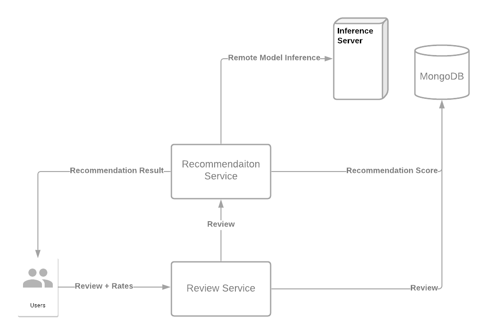

# Review Recommendation System Document

## We integrated our course review service with recommendation service.

- As shown in our system design diagram above, we have integrated our course review service with our recommendation service through a machine learning approach.
- The system aims to give an instructor ranking for a course based on review information.
- The walk-through for this system:
  - User creates a review on certain instructor.
    - The review has a string of review, integer value of `genernal rate` and integer value of `difficulty rate`. Note that the integer value for both `genernal rate` and `difficulty rate` are in 1-5, e.g. these are categorical data.
  - The review service receives the input data and send the review string to our recommendation service for a `recommendation score`.
  - The recommendation service passes this review string to our Azure server for machine learning text classification, where the review is classified into 5 classes, representing by integer value of 1-5 (The higher the better) 
  - Once the system has the `recommendation score`, the system stores the `recommendation score` into the system with other review information. During this process, instructor's average `recommendation score`, general score and difficulty score is updated.
  - When the user requests an instructor recommendation, the review result, together with `recommendation score`, are both retrieved from database. The system will give a complex ranking score generated by weighting `general rate` and `recoomendation score`. The higher ranking score indicates a more "recommended" instructor. The instructor will be ranked for our user.

## Machine Learning model training and inference 

##### Training

- We have trained and tested a variety of BERT models, a NLP transformer model developed by Goggle in 2018.
- The BERT model has shown outstanding performance in language understanding and have developed variants for different uses.
- We trained using a pre-trained SMALL-BERT MODEL ([here](https://tfhub.dev/google/collections/bert/1)), on a Kaggle 100K coursera course review dataset ([here](https://www.kaggle.com/septa97/100k-courseras-course-reviews-dataset)). This dataset has five classification categories and high quality reviews, so we reasonably expect it can be generalized to classify our data. 
  - Our platform:` 24 cores, 224 GB RAM, 4 x NVIDIA Tesla K80`, est. 5hrs for 10 Epoch.
  - Best result: accuracy of `83.7%`.
- Potential problems
  - The dataset is biased, it consists of ~79% of 5 cat.
  - We did not use the full BERT model, but a variant, for fast inference, may influence the performance.

##### Inference

- We deployed our model on a Microsoft Azure inference server. By our experience, we expect it to return the inference result in 10s. 
